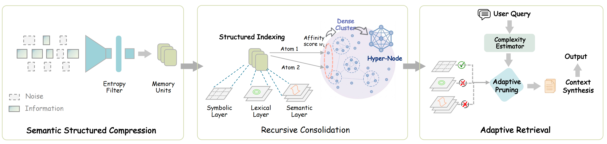

# SimpleMem: Efficient Lifelong Memory for LLM Agents

<div align="center">

<p align="center">
  
</p>


[](https://aiming-lab.github.io/SimpleMem-Page)

[](https://arxiv.org/abs/2601.02553)
[](https://github.com/aiming-lab/SimpleMem)
[](LICENSE)

</div>

---

## 📑 Table of Contents

- [🌟 Overview](#-overview)
- [🎯 Key Contributions](#-key-contributions)
- [🚀 Performance Highlights](#-performance-highlights)
- [📦 Installation](#-installation)
- [⚡ Quick Start](#-quick-start)
- [📊 Evaluation](#-evaluation)
- [📁 File Structure](#-file-structure)
- [📝 Citation](#-citation)
- [📄 License](#-license)
- [🙏 Acknowledgments](#-acknowledgments)

---

## 🌟 Overview

<div align="center">


*SimpleMem achieves superior F1 score (43.24%) with minimal token cost (~550), occupying the ideal top-left position.*
</div>


**SimpleMem** addresses the fundamental challenge of **efficient long-term memory for LLM agents** through a three-stage pipeline grounded in **Semantic Lossless Compression**. Unlike existing systems that either passively accumulate redundant context or rely on expensive iterative reasoning loops, SimpleMem maximizes **information density** and **token utilization** through:

<table>
<tr>
<td width="33%" align="center">

### 🔍 Stage 1
**Semantic Structured Compression**

Entropy-based filtering and de-linearization of dialogue into self-contained atomic facts

</td>
<td width="33%" align="center">

### 🗂️ Stage 2
**Structured Indexing**

Asynchronous evolution from fragmented atoms to higher-order molecular insights

</td>
<td width="33%" align="center">

### 🎯 Stage 3
**Adaptive Retrieval**

Complexity-aware pruning across semantic, lexical, and symbolic layers

</td>
</tr>
</table>



*The SimpleMem Architecture: A three-stage pipeline for efficient lifelong memory through semantic lossless compression*

---

### 🏆 Performance Comparison

<div align="center">

**Speed Comparison Demo**

<video src="https://github.com/aiming-lab/SimpleMem/raw/main/fig/simplemem-new.mp4" controls width="900"></video>

*SimpleMem vs. Baseline: Real-time speed comparison demonstration*

</div>

<div align="center">

**LoCoMo-10 Benchmark Results (GPT-4.1-mini)**

| Model | ⏱️ Construction Time | 🔎 Retrieval Time | ⚡ Total Time | 🎯 Average F1 |
|:------|:--------------------:|:-----------------:|:-------------:|:-------------:|
| A-Mem | 5140.5s | 796.7s | 5937.2s | 32.58% |
| LightMem | 97.8s | 577.1s | 675.9s | 24.63% |
| Mem0 | 1350.9s | 583.4s | 1934.3s | 34.20% |
| **SimpleMem** ⭐ | **92.6s** | **388.3s** | **480.9s** | **43.24%** |

</div>

> **💡 Key Advantages:**
> - 🏆 **Highest F1 Score**: 43.24% (+26.4% vs. Mem0, +75.6% vs. LightMem)
> - ⚡ **Fastest Retrieval**: 388.3s (32.7% faster than LightMem, 51.3% faster than Mem0)
> - 🚀 **Fastest End-to-End**: 480.9s total processing time (12.5× faster than A-Mem)

---

## 🎯 Key Contributions

### 1️⃣ Semantic Lossless Compression Pipeline

SimpleMem transforms raw, ambiguous dialogue streams into **atomic entries** — self-contained facts with resolved coreferences and absolute timestamps. This **write-time disambiguation** eliminates downstream reasoning overhead.

**✨ Example Transformation:**
```diff
- Input:  "He'll meet Bob tomorrow at 2pm"  [❌ relative, ambiguous]
+ Output: "Alice will meet Bob at Starbucks on 2025-11-16T14:00:00"  [✅ absolute, atomic]
```

---

### 2️⃣ Structured Multi-View Indexing

Memory is indexed across three **structured dimensions** for robust, multi-granular retrieval:

<div align="center">

| 🔍 Layer | 📊 Type | 🎯 Purpose | 🛠️ Implementation |
|---------|---------|------------|-------------------|
| **Semantic** | Dense | Conceptual similarity | Vector embeddings (1024-d) |
| **Lexical** | Sparse | Exact term matching | BM25-style keyword index |
| **Symbolic** | Metadata | Structured filtering | Timestamps, entities, persons |

</div>

---

### 3️⃣ Complexity-Aware Adaptive Retrieval

Instead of fixed-depth retrieval, SimpleMem dynamically estimates **query complexity** ($C_q$) to modulate retrieval depth:

$$k_{dyn} = \lfloor k_{base} \cdot (1 + \delta \cdot C_q) \rfloor$$

<table>
<tr>
<td width="50%">

**🔹 Low Complexity Queries**
- Retrieve minimal molecular headers
- ~100 tokens
- Fast response time

</td>
<td width="50%">

**🔸 High Complexity Queries**
- Expand to detailed atomic contexts
- ~1000 tokens
- Comprehensive coverage

</td>
</tr>
</table>

**📈 Result**: 43.24% F1 score with **30× fewer tokens** than full-context methods.

---

## 🚀 Performance Highlights


### 📊 Benchmark Results (LoCoMo)

<details>
<summary><b>🔬 High-Capability Models (GPT-4.1-mini)</b></summary>

| Task Type | SimpleMem F1 | Mem0 F1 | Improvement |
|:----------|:------------:|:-------:|:-----------:|
| **MultiHop** | 43.46% | 30.14% | **+43.8%** |
| **Temporal** | 58.62% | 48.91% | **+19.9%** |
| **SingleHop** | 51.12% | 41.3% | **+23.8%** |

</details>

<details>
<summary><b>⚙️ Efficient Models (Qwen2.5-1.5B)</b></summary>

| Metric | SimpleMem | Mem0 | Notes |
|:-------|:---------:|:----:|:------|
| **Average F1** | 25.23% | 23.77% | Competitive with 99× smaller model |

</details>

---

## 📦 Installation

### 📋 Requirements
- 🐍 Python 3.8+
- 🔑 OpenAI-compatible API (OpenAI, Qwen, Azure OpenAI, etc.)

### 🛠️ Setup

```bash
# 📥 Clone repository
git clone https://github.com/aiming-lab/SimpleMem.git
cd SimpleMem

# 📦 Install dependencies
pip install -r requirements.txt

# ⚙️ Configure API settings
cp config.py.example config.py
# Edit config.py with your API key and preferences
```

### ⚙️ Configuration Example

```python
# config.py
OPENAI_API_KEY = "your-api-key"
OPENAI_BASE_URL = None  # or custom endpoint for Qwen/Azure

LLM_MODEL = "gpt-4.1-mini"
EMBEDDING_MODEL = "Qwen/Qwen3-Embedding-0.6B"  # State-of-the-art retrieval
```

---

## ⚡ Quick Start

### 🎓 Basic Usage

```python
from main import SimpleMemSystem

# 🚀 Initialize system
system = SimpleMemSystem(clear_db=True)

# 💬 Add dialogues (Stage 1: Semantic Structured Compression)
system.add_dialogue("Alice", "Bob, let's meet at Starbucks tomorrow at 2pm", "2025-11-15T14:30:00")
system.add_dialogue("Bob", "Sure, I'll bring the market analysis report", "2025-11-15T14:31:00")

# ✅ Finalize atomic encoding
system.finalize()

# 🔎 Query with adaptive retrieval (Stage 3: Adaptive Query-Aware Retrieval)
answer = system.ask("When and where will Alice and Bob meet?")
print(answer)
# Output: "16 November 2025 at 2:00 PM at Starbucks"
```

---

### 🚄 Advanced: Parallel Processing

For large-scale dialogue processing, enable parallel mode:

```python
system = SimpleMemSystem(
    clear_db=True,
    enable_parallel_processing=True,  # ⚡ Parallel memory building
    max_parallel_workers=8,
    enable_parallel_retrieval=True,   # 🔍 Parallel query execution
    max_retrieval_workers=4
)
```

> **💡 Pro Tip**: Parallel processing significantly reduces latency for batch operations!

---


## 📊 Evaluation

### 🧪 Run Benchmark Tests

```bash
# 🎯 Full LoCoMo benchmark
python test_locomo10.py

# 📉 Subset evaluation (5 samples)
python test_locomo10.py --num-samples 5

# 💾 Custom output file
python test_locomo10.py --result-file my_results.json
```

---

### 🔬 Reproduce Paper Results

Use the exact configurations in `config.py`:
- **🚀 High-capability**: GPT-4.1-mini, Qwen3-Plus
- **⚙️ Efficient**: Qwen2.5-1.5B, Qwen2.5-3B
- **🔍 Embedding**: Qwen3-Embedding-0.6B (1024-d)


---

## 📝 Citation

If you use SimpleMem in your research, please cite:

```bibtex
@article{simplemem2025,
  title={SimpleMem: Efficient Lifelong Memory for LLM Agents},
  author={Liu, Jiaqi and Su, Yaofeng and Xia, Peng and Zhou, Yiyang and Han, Siwei and  Zheng, Zeyu and Xie, Cihang and Ding, Mingyu and Yao, Huaxiu},
  journal={arXiv preprint arXiv:2601.02553},
  year={2025},
  url={https://github.com/aiming-lab/SimpleMem}
}
```

---

## 📄 License

This project is licensed under the **MIT License** - see the [LICENSE](LICENSE) file for details.

---

## 🙏 Acknowledgments

We would like to thank the following projects and teams:

- 🔍 **Embedding Model**: [Qwen3-Embedding](https://github.com/QwenLM/Qwen) - State-of-the-art retrieval performance
- 🗄️ **Vector Database**: [LanceDB](https://lancedb.com/) - High-performance columnar storage
- 📊 **Benchmark**: [LoCoMo](https://github.com/snap-research/locomo) - Long-context memory evaluation framework


</div>
